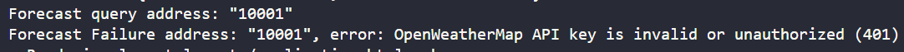

# Weather Forecast

Ruby on Rails application to check weather forecasts using US ZIP codes or addresses, powered by [OpenWeather API](https://openweathermap.org/api).

## Technologies Used

- Ruby on Rails
- HTTParty (HTTP requests)
- Rails Cache (memory caching)
- OpenWeather API

## How to Run Locally

1. **Clone the repository**

   ```
   git clone https://github.com/ThierrryScotto/weather_forecast.git
   cd weather_forecast
   ```

2. **Install dependencies**

   ```
   bundle install
   ```

3. **Set up environment variables**

   - Copy `.env.example` to `.env` and fill in the required variables, especially your OpenWeather API key.

   ```
   cp .env.example .env
   ```

4. **Start the Rails server**

   ```
   rails server
   ```

5. **Access the application**

   Open your browser and go to:

   ```
   http://localhost:3000
   ```

## API Results (Screenshots)

Below are some screenshots showing the API results in the application:

## Home page


### Success case with zip code 10001


backend log


### Success case with zip code 10001 using cache


### Error case with an invalid ZIP code 100012


backend log


### Error case with a connection error to the OpenWeather API


backend log


## Notes

- Caching is used to avoid repeated requests for 30 minutes.
- If the address/ZIP code is not found, an empty result is returned.

## Example Response

```json
{
  "name": "New York",
  "main": {
    "temp": 18.0,
    "temp_min": 18.0,
    "temp_max": 18.0,
    "humidity": 77
  },
  "weather": [
    {
      "description": "clear sky",
      "icon": "01d"
    }
  ]
}
```

## Ruby & Rails Versions

- **Ruby:** 3.2.2
- **Ruby on Rails:** 7.1.2